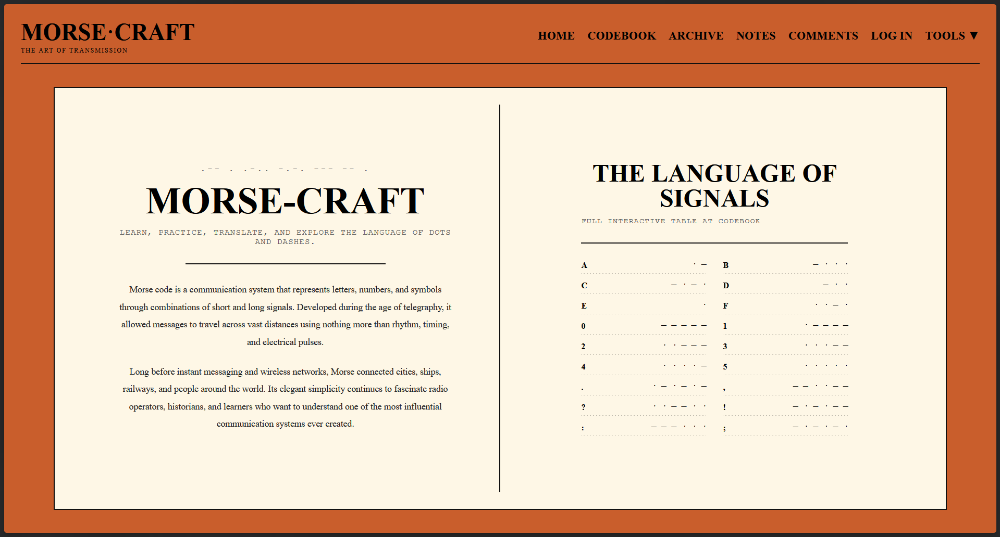
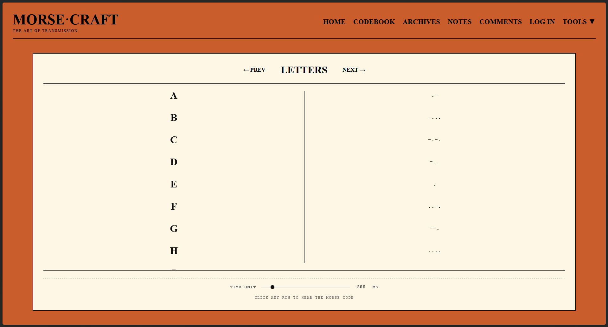
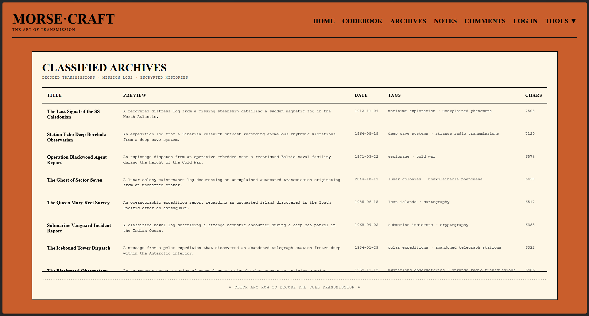
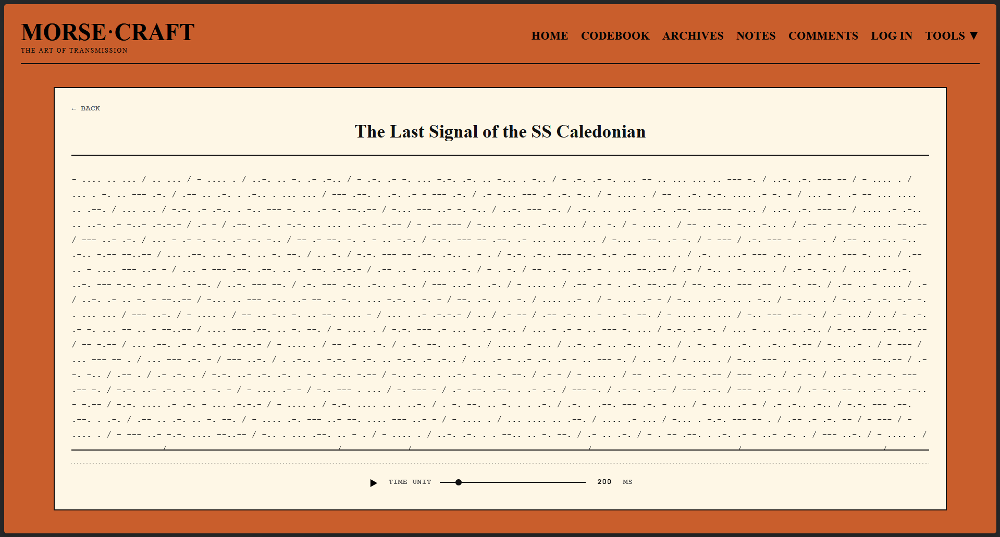
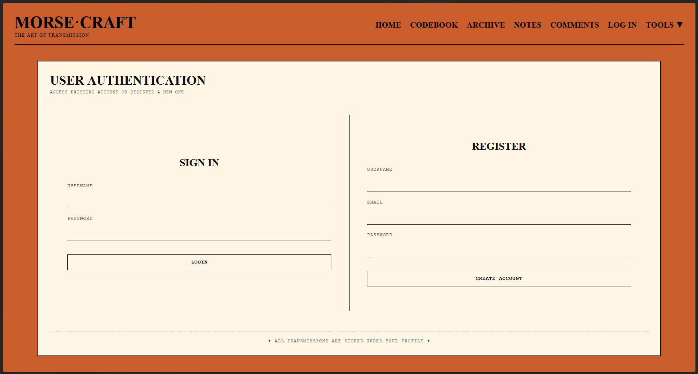
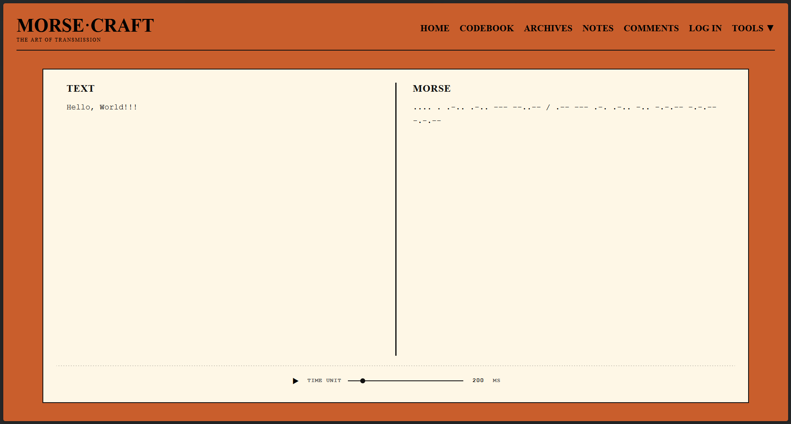
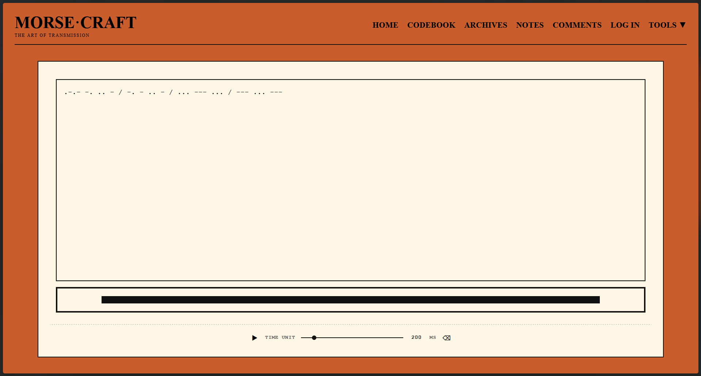
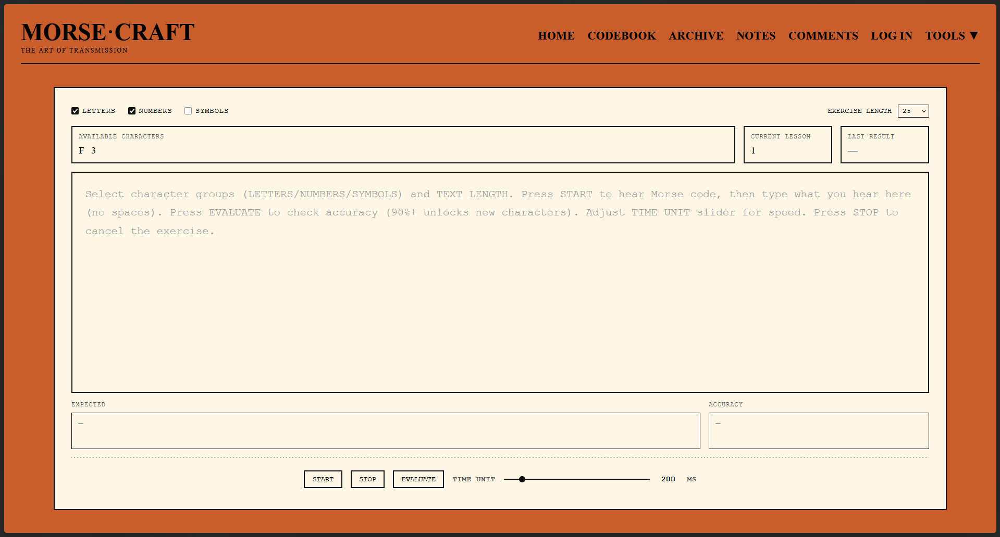

# MORSE-CRAFT

> A Morse code learning platform featuring real-time translation, interactive training, audio playback, and a virtual telegraph key.

Built with Flask, SQLite, SQLAlchemy, and the Web Audio API, Morse-Craft combines educational tools, community features, and a vintage communications aesthetic to create an engaging environment for learning Morse code.

---

## 🚀 Live Demo & Visuals

- **Application Link:** [https://morse-craft.onrender.com/](https://morse-craft.onrender.com/)

## 🧪 Suggested Interactions

Try these workflows to explore the application:

- **Translate a message:** Navigate to the **Translator** and type text in the left panel — watch it convert to Morse in real time.
- **Send a telegraph:** Go to the **Telegraph** and click, hold the mouse, or press the spacebar to transmit dots and dashes with live audio feedback.
- **Train your ear:** Open **Training**, select character groups, press START, and type what you hear to unlock new characters.
- **Browse the archives:** Visit the **Archives** to explore classified transmissions and replay them as Morse audio.
- **Save your work:** Log in, tap out a message on the Telegraph, and save it as a personal note or post it to public Comments.

You can also experiment with the Codebook by clicking any row to hear the Morse code for that character.

### App Preview

|           Home Page           |             Codebook             |
| :---------------------------: | :------------------------------: |
|  |  |

|                      Browser                      |                     Reader                      |
| :-----------------------------------------------: | :---------------------------------------------: |
|  |  |

|             Auth              |              Translator              |
| :---------------------------: | :----------------------------------: |
|  |  |

|             Telegraph              |             Training             |
| :--------------------------------: | :------------------------------: |
|  |  |

---

## 📑 Overview

Morse-Craft is a full-stack web application designed to help users learn, practice, and explore Morse code through a collection of interactive tools.

Unlike simple translation tools, Morse-Craft focuses on active learning. Users can listen to Morse code, practice recognition, improve transmission skills, and gradually unlock new characters through structured training exercises.

The platform combines translation tools, interactive training, a virtual telegraph key, community features, and historical-style archives within a telegraph-inspired user interface.

---

## ✨ Highlights

- **Real-Time Translation:** Instantly convert between text and Morse code with adjustable playback speed.
- **Virtual Telegraph Key:** Transmit Morse code using mouse, keyboard, and touch input with real-time audio feedback.
- **Progressive Training System:** Unlock new characters only after achieving high accuracy, creating a structured learning path.
- **Community Features:** Save private notes or share Morse messages publicly.
- **Classified Archives:** Explore historical-style transmissions and replay them as Morse audio.
- **Shared Audio Utility:** A reusable Web Audio helper (beep) used across modules for consistent playback.

---

## 🛠️ Technology Stack

| Layer              | Technologies & Libraries Used                |
| :----------------- | :------------------------------------------- |
| **Frontend UI**    | HTML5, CSS3, Vanilla JavaScript (ES Modules) |
| **Backend Server** | Python, Flask                                |
| **Database**       | SQLite, SQLAlchemy ORM                       |
| **Authentication** | Werkzeug (password hashing), Flask-Session   |
| **Audio**          | Web Audio API (OscillatorNode, GainNode)     |

---

## 🏗️ System Architecture & Data Flow

### Page & API Flow

```text
┌─────────────────────────────────────────────────────┐
│                   TEMPLATES (Jinja2)                │
│  index · codebook · archive · notes · comments      │
│  auth · account · translator · telegraph · training │
└──────────────────────┬──────────────────────────────┘
                       │
┌──────────────────────▼──────────────────────────────┐
│                  JAVASCRIPT MODULES                 │
│  codebook.js · archive.js · notes.js · comments.js  │
│  translator.js · telegraph.js · training.js         │
│  data.js (conversion tables) · utils.js (beep)      │
└──────────────────────┬──────────────────────────────┘
                       │
┌──────────────────────▼──────────────────────────────┐
│                    API ENDPOINTS                    │
│  /api/codebook/<type>     /api/archive/<id>         │
│  /api/note/<id>           /api/notes (POST)         │
│  /api/notedelete/<id>     /api/comments/<id>        │
│  /api/comment (POST)      /api/commentdelete/<id>   │
└─────────────────────────────────────────────────────┘
```

---

### Database Design

Morse-Craft uses a relational SQLite database managed through SQLAlchemy ORM.

```text
┌─────────┐
│  Users  │
└────┬────┘
     │
     ├───────────┐
     │           │
     ▼           ▼
┌─────────┐ ┌──────────┐
│  Notes  │ │ Comments │
└─────────┘ └──────────┘

┌──────────┐
│ Archives │
└──────────┘
```

---

#### Core Entities

- **Users** — Account information, authentication credentials, and ownership of user-generated content.
- **Notes** — Private Morse code messages saved by authenticated users.
- **Comments** — Public Morse code messages shared with the community.
- **Archives** — Pre-seeded curated transmissions used for exploration and listening practice.

---

#### Design Decisions

- All user-generated content is stored as Morse code strings, enabling consistent playback and interaction across the application.
- Notes and Comments are linked to users through foreign-key relationships.
- Archive records are pre-seeded and serve as reusable training and exploration content.
- SQLAlchemy handles relationships, constraints, and ORM-level database management.

````

## 📂 Project Structure

```text
morse-craft/
├── assets/
├── instance/
├── static/
│   ├── css/
│   └── js/
├── templates/
├── .gitignore
├── LICENSE
├── Procfile
├── README.md
├── app.py
├── data.py
├── models.py
├── requirements.txt
└── seed.py
````

---

## ⚙️ Installation & Setup

Follow these steps to clone the project, install dependencies, and run locally.

```bash
git clone https://github.com/jzb-01/morse-craft.git
cd morse-craft

python -m venv venv

# Linux/macOS
source venv/bin/activate

# Windows
venv\Scripts\activate

pip install -r requirements.txt
```

---

### Start the Application

```bash
python app.py
```

Open your browser at: `http://127.0.0.1:5000`

---

## 💡 Technical Challenges

- **Real-Time Telegraph Key:** Building a virtual telegraph key that classifies press duration into dots and dashes while supporting mouse, keyboard, and touch input, with smooth audio fade-in/out. Window blur events are used to safely reset input state when focus is lost.
- **Morse Audio System:** Implementing a reusable Web Audio API beep utility shared across all modules, supporting live input, sequential playback, and training exercises.
- **Progressive Training Logic:** Designing a character-unlocking system that introduces new symbols only after achieving 90%+ accuracy using position-by-position evaluation, while maintaining a shuffled character pool.
- **Authentication & Authorization:** Managing session-based authentication with protected endpoints that return 401/403 responses where appropriate and conditionally rendering UI elements based on ownership.
- **Content-as-Morse Architecture:** All stored content is represented as Morse code strings, requiring consistent encoding during seeding.

---

## 🧠 What I Learned

- **Full-Stack Web Development:** Flask backend with REST APIs and modular ES module frontend architecture.
- **Web Audio API:** Real-time sound generation using OscillatorNode and GainNode with controlled timing.
- **SQLAlchemy ORM:** Modeling relational data with foreign keys and automated schema management.
- **Authentication Systems:** Secure login using password hashing and session-based access control.
- **Event-Driven UI Programming:** Handling mouse, keyboard, touch, and window blur events using state-based logic (telegraph module).
- **Modular JavaScript Design:** Shared utilities and data modules reused across multiple independent features.
- **Progressive Learning Design:** Adaptive training system that unlocks content based on performance.

---

## 📌 Potential Enhancements

- **Training Statistics Dashboard:** Track accuracy progression and learning speed over time.
- **Comment Reply Threads:** Add nested comment structure with parent-child relationships.
- **Real-Time Multiplayer Telegraph:** WebSocket-based Morse communication between users.

---

## 📄 License & Author

- **License:** MIT
- **Author:** Jordan Zarate
- **Repository:** [https://github.com/jzb-01/morse-craft.git](https://github.com/jzb-01/morse-craft.git)

---
